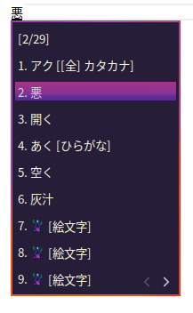
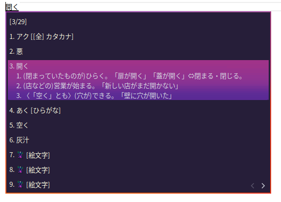

# Fcitx5 Theme

## Sweet Dark theme

- Normal



- With Comments


 
 ## Install

 ```
git clone https://github.com/yasuking0304/fcitx5-sweet-dark-theme.git ~/.local/share/fcitx5/themes/fcitx5-sweet-dark-theme
```

and

```
Settings -> Locales -> Input Method -> Setting AddOn -> Classic UI Interface -> Change Theme to "Sweet Dark"
```
日本人向け(KDEシステム設定の場合)
```
設定 -> 地域の設定 -> 入力メソッド -> アドオンを設定 -> クラシックユーザーインターフェース -> テーマを "Sweet Dark" に変更
```

## License

This is free and unencumbered software released into the public domain.

Anyone is free to copy, modify, publish, use, compile, sell, or distribute this software, either in source code form or as a compiled binary, for any purpose, commercial or non-commercial, and by any means.

## ライセンス(日本人向け)

このソフトウェアは、パブリックドメインです。

このソフトウェアを、ソースコード形式またはコンパイルされたバイナリとして、断りなく、商用または非商用を問わず、あらゆる目的で自由にコピー、変更、公開、使用、コンパイル、販売、または配布できます。
